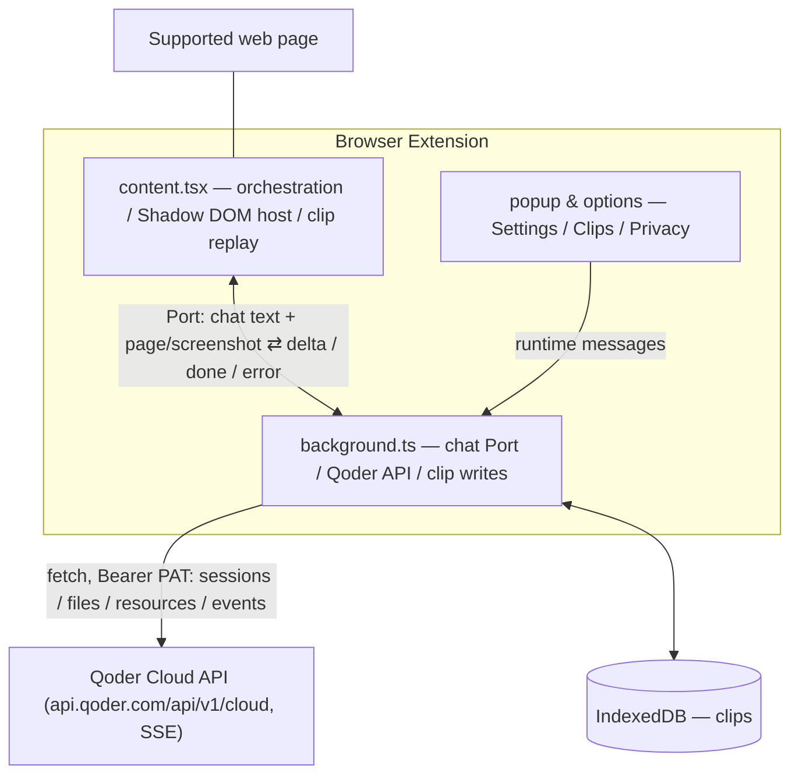

<p align="center">
  
</p>

<h1 align="center">Tab Agent</h1>

<p align="center">
  <b>English</b> | <a href="README.zh-CN.md">中文</a>
</p>

A chat-bubble mascot for supported web pages. Click it and ask — your configured Qoder Cloud Agent answers from the page context you choose to share.

> [!NOTE]
> Not an official Qoder product. Built on Qoder Cloud Agents, and the mascot borrows the Qoder logo because it's cute.

## Features

- **Ask your page** — choose no context, extracted article text, or a screenshot. Article text is capped at 20,000 characters; screenshots cover the visible area of the sender's browser window.
- **Clips** — save a selection, whole page, or image from the context menu. Selection clips also support `Alt+Shift+S`, text-fragment highlights, notes, search, and cross-page navigation.
- **Settings** — change language, theme, pet visibility, page context, and clip highlighting.

## Quick Start

Prerequisites: Node.js ≥ 22.13 and pnpm 11.13.1; a [Qoder](https://qoder.com) account with [Cloud Agents](https://docs.qoder.com/cloud-agents/quickstart) enabled.

```bash
pnpm install
pnpm build          # Output: .output/chrome-mv3/
```

Load in Chrome:

1. Open `chrome://extensions`, enable **Developer mode** (top-right).
2. Click **Load unpacked**, select the `.output/chrome-mv3/` directory.

Firefox: `pnpm build:firefox` / `pnpm dev:firefox`. The Firefox build is written to `.output/firefox-mv2/`; load its `manifest.json` from `about:debugging` for a temporary install.

## Configuration

The extension talks directly to your own Qoder Cloud Agent through `https://api.qoder.com/api/v1/cloud`. Create or select the Agent and Environment in Qoder first; the extension does not create or configure them. You need three values:

| Credential | Example | Where to get |
|---|---|---|
| PAT | `pt-...` | [Qoder console → Personal Access Tokens → Create](https://qoder.com/cloud/pat-keys) |
| Agent ID | `agent_...` | [Cloud Agents console](https://qoder.com/cloud/agents) → the Agent to run |
| Environment ID | `env_...` | [Cloud environments](https://qoder.com/cloud/environments) → the Environment to run it in |

Fill them in:

1. Click the Tab Agent toolbar icon → gear icon (or right-click the icon → Options) to open Settings.
2. Paste PAT / Agent ID / Environment ID. Fields save on blur.
3. Language and theme (system / dark / light) can also be changed here.

PAT is sent as `Authorization: Bearer <PAT>` on Cloud API requests. Agent ID and Environment ID are sent when the extension creates a session. Values are stored in the browser's local extension storage; the password fields only mask them in the UI. Changing Agent ID or Environment ID takes effect when a new daily session is created.

The extension only checks that all three values are non-empty. Qoder validates the token, Agent, and Environment.

## Usage

1. Open a supported webpage — the mascot appears in the bottom-right corner. Browser-controlled pages such as `chrome://` and extension stores cannot run the content script.
2. Choose Page Context in the popup: None sends only the question; Article text sends the current URL, title, and extracted text; Screenshot sends the URL, title, and a JPEG of the visible tab window.
3. Click the mascot and type a question. The answer streams in. A new session is created only when there is no valid session for the current local day.
4. Select text and press `Alt+Shift+S` (or use the context menu) to save it as a clip. Rebind the shortcut under `chrome://extensions/shortcuts`.

## Troubleshooting

| Symptom | Fix |
|---|---|
| "Not configured" error | PAT / Agent ID / Environment ID incomplete — fill all three in Settings |
| "Auth failed" error | PAT expired or wrong — regenerate one |
| Screenshot context not working | Allow the extension's `<all_urls>` host access. It is a required host permission used by content scripts, lazy-loaded chunks, and screenshot capture; the popup only rechecks it when the browser has withheld or revoked it. |
| Want a fresh session | Remove `local:sessionId.v4` from extension local storage and restart/reload the extension background context. The in-memory cache survives until that context ends. This creates a new Qoder session but does not delete the old cloud session or its events. |
| Agent or Environment changes are ignored | End the current background context or wait for the daily session to rotate; those IDs are read when a new session is created. |

## Development

```bash
pnpm dev            # Chrome HMR dev server (auto-opens browser)
pnpm dev:firefox    # Firefox development server
pnpm build          # Chrome MV3 package: .output/chrome-mv3/
pnpm build:firefox  # Firefox package: .output/firefox-mv2/
pnpm analyze        # Production bundle analysis
pnpm test           # Run tests (Vitest)
pnpm compile        # Type-check only
pnpm test:e2e       # Local real-browser checks; run after pnpm build
pnpm test:chat      # Live Qoder chat E2E; needs .env credentials
pnpm test:features  # Full live feature E2E; needs .env credentials
pnpm zip            # Chrome Web Store submission package
pnpm zip:firefox    # Firefox AMO submission package
```

The live E2E scripts read `PAT`, `AGENT_ID`, and `ENV_ID` from a repo-root `.env`. Keep that file local and never commit it.

Add UI components:

```bash
pnpm dlx shadcn@latest add @retroui/<name>
```

## Project Structure



```
entrypoints/
  background.ts     # Service worker entry (menus, commands, message/port wiring)
  content.tsx       # Content script orchestration (lazy UI, page text, highlights, clip messages)
  popup/            # Browser action popup
  options/          # Options page (Settings / Clips / Privacy)
components/
  floating-agent.tsx  # Floating pet composition layer (state, port streaming, drag)
  agent/            # Presentational parts: Mascot / ChatPanel / ClipDraftEditor
  category-chips.tsx  # Clip category filter chips (options Clips page)
  radio-dropdown.tsx  # Icon+label single-select dropdown (settings / popup / filter)
  ui/               # RetroUI components (shadcn CLI)
lib/                # Shared modules (gateway, i18n, settings, SSE parser, clips, page text)
tests/              # Vitest test suites
```

## Tech Stack

- **Framework**: [WXT](https://wxt.dev) (Vite-based extension framework; Chrome MV3, Firefox MV2 output)
- **UI**: React 19 + TypeScript + [RetroUI](https://retroui.dev) (neobrutalist shadcn registry) + Tailwind CSS v4
- **Icons**: [lucide-react](https://lucide.dev)
- **Page text**: [@mozilla/readability](https://github.com/mozilla/readability)
- **Clip highlighting**: [text-fragments-polyfill](https://github.com/GoogleChromeLabs/text-fragments-polyfill)
- **Package Manager**: pnpm

## Data and Privacy

- Settings, credentials, the daily session ID, and the SSE cursor stay in browser-local extension storage. Clips stay in the extension's IndexedDB; saving, editing, and deleting clips do not call Qoder.
- A chat request is sent only after you submit a question. Depending on Page Context, the extension sends the question alone, the question plus URL/title/article text, or the question plus URL/title and a visible-tab screenshot.
- The extension has no analytics, trackers, telemetry, or automatic background upload. Qoder Cloud handles the session and any network activity performed by the configured Agent according to Qoder's policies and configuration.

## License

[MIT](LICENSE) © sheny. Built with [Qoder](https://qoder.com).
