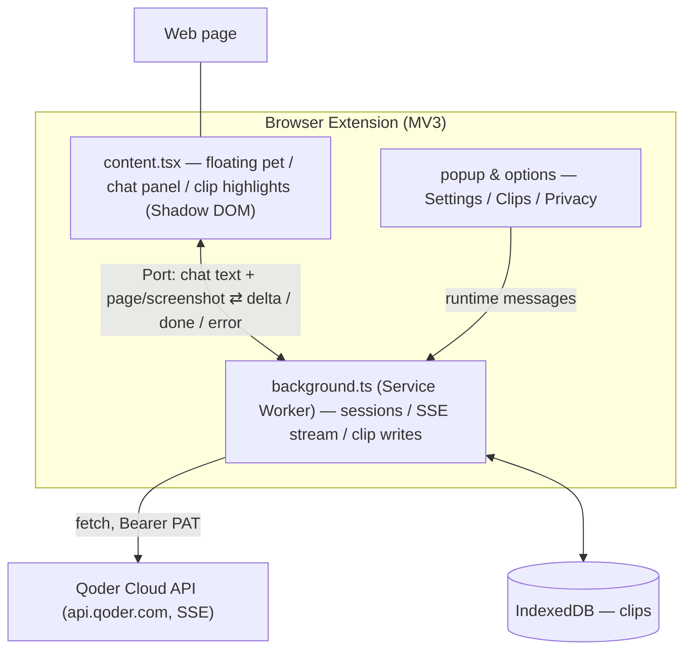

# Tab Agent

A pixel-art pet that lives on every webpage. Click it, ask a question, and your configured Qoder Cloud Agent answers based on the page you're viewing. Also: save text selections as clips (right-click menu or `Alt+Shift+S`, text-fragment highlights), and classify them with AI.

**English** | [中文](README.zh-CN.md)

## Tech Stack

- **Framework**: [WXT](https://wxt.dev) (Vite-based extension framework, Chrome MV3)
- **UI**: React 19 + [RetroUI](https://retroui.dev) (neobrutalist shadcn registry) + Tailwind CSS v4
- **Icons**: [lucide-react](https://lucide.dev)
- **Package Manager**: pnpm

## Prerequisites

- Node.js ≥ 22.13 and pnpm
- A [Qoder](https://qoder.com) account with [Cloud Agents](https://docs.qoder.com/zh/cloud-agents/quickstart) enabled

## Build & Install

```bash
pnpm install
pnpm build          # Output: .output/chrome-mv3/
```

Load in Chrome:

1. Open `chrome://extensions`, enable **Developer mode** (top-right).
2. Click **Load unpacked**, select the `.output/chrome-mv3/` directory.

For development: `pnpm dev` (HMR, auto-opens browser). Firefox: `pnpm build:firefox` / `pnpm dev:firefox`.

## Configuration

The extension talks to your own Qoder Cloud Agent. You need three credentials:

| Credential | Format | Where to get |
|---|---|---|
| PAT | `pt-...` | Qoder console → Settings → Personal Access Tokens → Create |
| Agent ID | `agent_...` | [Cloud Agents console](https://qoder.com/cloud/agents) → your Agent |
| Environment ID | `env_...` | Same page, the environment linked to your Agent |
| Vault ID (optional) | `vault_...` | Only if you want sessions to mount a vault |

Fill them in:

1. Click the Tab Agent toolbar icon → gear icon (or right-click the icon → Options) to open Settings.
2. Paste PAT / Agent ID / Environment ID (and Vault ID if needed). Fields save on blur.
3. Language and theme (system / dark / light) can also be changed here.

## Shortcuts

- `Alt+Shift+S` — save the current selection as a clip (needs text selected first;
  rebindable under `chrome://extensions/shortcuts`).

## Verify

1. Open any webpage — a pixel pet should appear in the bottom-right corner.
2. Click the pet, type a question — the pet enters "thinking" state and the answer streams in.
3. The first question creates a cloud session, which may take a moment.

## Troubleshooting

| Symptom | Fix |
|---|---|
| "Not configured" error | PAT / Agent ID / Environment ID incomplete — fill all three in Settings |
| "Auth failed" error | PAT expired or wrong — regenerate one |
| Screenshot context not working | Approve the site-access permission prompt when selecting "Screenshot" in the popup |
| Want a fresh session | Clear `local:sessionId.v4.tab.<tabId>` via the extension's Service Worker console, or reinstall |

## Packaging

```bash
pnpm zip            # Chrome Web Store submission
pnpm zip:firefox    # Firefox AMO submission
```

## Project Structure



```
entrypoints/
  background.ts     # Service worker entry (menus, commands, message/port wiring)
  content.tsx       # Content script (floating pet + chat panel + clip highlights)
  popup/            # Browser action popup
  options/          # Options page (Settings / Clips / Privacy)
components/
  floating-agent.tsx  # Floating pet composition layer (state, port streaming, drag)
  agent/            # Presentational parts: Mascot / ChatPanel / ClipDraftEditor
  ui/               # RetroUI components (shadcn CLI)
lib/                # Shared modules (gateway, classify, i18n, settings, SSE parser, clips)
tests/              # Vitest test suites
```

## Development

```bash
pnpm dev            # Chrome HMR dev server
pnpm test           # Run tests (Vitest)
pnpm compile        # Type-check only
```

Add UI components:

```bash
pnpm dlx shadcn@latest add @retroui/<name>
```

## License

[MIT](LICENSE) © sheny. Built with [Qoder](https://qoder.com).
