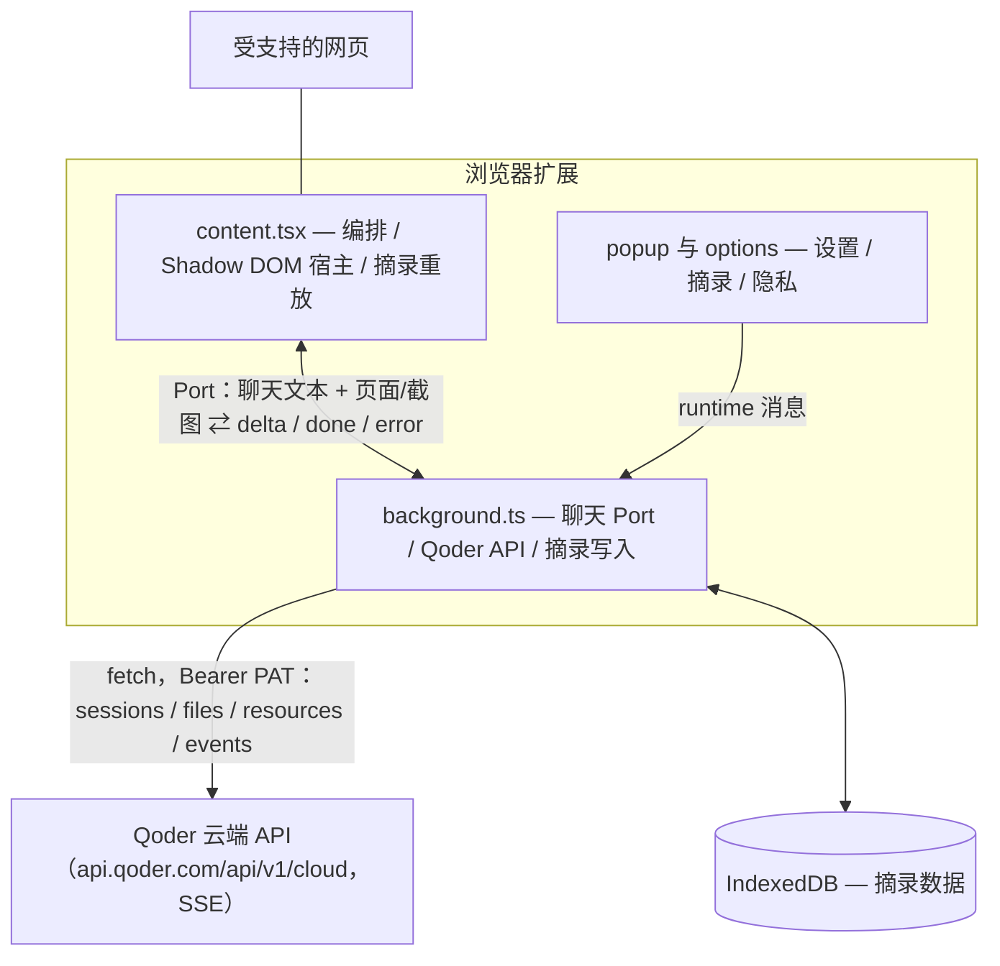

<p align="center">
  
</p>

<h1 align="center">Tab Agent</h1>

<p align="center">
  <a href="README.md">English</a> | <b>中文</b>
</p>

一只运行在受支持网页上的气泡小宠物。点击它提问，你配置的 Qoder 云端 Agent 会根据你选择携带的页面内容作答。

> [!NOTE]
> 本项目非 Qoder 官方产品，仅基于 Qoder Cloud Agents 构建；吉祥物形象借用了 Qoder 的 logo（因为可爱）。

## 功能

- **问页面** —— 可选择不携带页面、携带正文或携带截图。正文最多 20,000 个字符；截图取发起请求的浏览器窗口可见区域。
- **摘录** —— 右键菜单保存选区、整页或图片；选区也可用 `Alt+Shift+S`，支持 text-fragment 高亮、备注、搜索和跨页跳转。
- **设置** —— 可切换语言、主题、宠物显示、页面携带方式和摘录高亮。

## 快速开始

前置条件：Node.js ≥ 22.13 与 pnpm 11.13.1；一个 [Qoder](https://qoder.com) 账号，且已开通 [Cloud Agents](https://docs.qoder.com/zh/cloud-agents/quickstart)。

```bash
pnpm install
pnpm build          # 产物在 .output/chrome-mv3/
```

Chrome 加载：

1. 打开 `chrome://extensions`，右上角开启「开发者模式」。
2. 点「加载已解压的扩展程序」，选择 `.output/chrome-mv3/` 目录。

Firefox：`pnpm build:firefox` / `pnpm dev:firefox`。Firefox 产物在 `.output/firefox-mv2/`；临时安装时，在 `about:debugging` 中选择其中的 `manifest.json`。

## 配置

扩展通过 `https://api.qoder.com/api/v1/cloud` 直接连接你自己的 Qoder 云端 Agent。请先在 Qoder 中创建或选择 Agent 和 Environment；扩展不会创建或配置它们。需要三项值：

| 凭证 | 示例 | 从哪拿 |
|---|---|---|
| PAT | `pt-...` | [Qoder 控制台 → Personal Access Tokens → 新建](https://qoder.com/cloud/pat-keys) |
| Agent ID | `agent_...` | [Cloud Agents 控制台](https://qoder.com/cloud/agents) → 要运行的 Agent |
| Environment ID | `env_...` | [Cloud environments](https://qoder.com/cloud/environments) → 要运行的 Environment |

填入方式：

1. 点浏览器工具栏的 Tab Agent 图标 → 齿轮图标（或右键图标 → 选项），打开设置页。
2. 依次粘贴 PAT / Agent ID / Environment ID。输入框失焦即保存。
3. 同页可切换语言与主题（跟随设备 / 深色 / 浅色）。

PAT 会作为 `Authorization: Bearer <PAT>` 用于 Cloud API 请求；Agent ID 和 Environment ID 只会在创建会话时发送。它们保存在浏览器扩展的本地存储中，密码框只负责遮挡显示，并不代表应用层加密。修改 Agent ID 或 Environment ID 后，要等下一条新会话创建时才会生效。

扩展只检查三项是否非空，令牌、Agent 和 Environment 的格式与资源有效性由 Qoder 校验。

## 使用

1. 打开受支持的网页，右下角出现气泡宠物。`chrome://`、扩展商店等浏览器控制页面无法运行内容脚本。
2. 在 Popup 选择「携带页面」：无只发送问题；正文会发送当前 URL、标题和提取正文；截图会发送 URL、标题和当前标签页可见区域 JPEG。
3. 点宠物提问，回答会流式出现。只有当前本地日期没有有效会话时，才会创建新的云端会话。
4. 选中文字按 `Alt+Shift+S`（或用右键菜单）保存为摘录。可在 `chrome://extensions/shortcuts` 改键。

## 常见问题

| 现象 | 处理 |
|---|---|
| 提示「尚未配置」 | PAT / Agent ID / Environment ID 三项有缺，回设置页补全 |
| 提示「鉴权失败」 | PAT 失效或填错，重新生成一个 |
| 截图上下文不生效 | 请允许扩展的 `<all_urls>` 主机访问。它是内容脚本、按需 chunk 注入和截图共同需要的必需权限；Popup 只会在浏览器暂缓或撤销权限时重新检查。 |
| 想强制开新会话 | 从扩展本地存储删除 `local:sessionId.v4`，并重启/重新加载扩展后台上下文。后台内存缓存会一直保留到该上下文结束。这样会创建新的 Qoder 会话，但不会删除旧云端会话或其中事件。 |
| 修改 Agent 或 Environment 后没有变化 | 结束当前后台上下文或等待每日会话轮换；这两个 ID 在创建新会话时读取。 |

## 开发

```bash
pnpm dev            # Chrome HMR 开发服务器（自动拉起浏览器）
pnpm dev:firefox    # Firefox 开发服务器
pnpm build          # Chrome MV3 产物：.output/chrome-mv3/
pnpm build:firefox  # Firefox 产物：.output/firefox-mv2/
pnpm analyze        # 生产 bundle 分析
pnpm test           # 运行测试（Vitest）
pnpm compile        # 仅类型检查
pnpm test:e2e       # 本地真浏览器检查，需先 pnpm build
pnpm test:chat      # 真实 Qoder 聊天 E2E，需要 .env 凭证
pnpm test:features  # 完整真实功能 E2E，需要 .env 凭证
pnpm zip            # Chrome 商店提交包
pnpm zip:firefox    # Firefox AMO 提交包
```

真实 E2E 脚本从仓库根目录 `.env` 读取 `PAT`、`AGENT_ID`、`ENV_ID`。请只在本地保存，不要提交该文件。

添加 UI 组件：

```bash
pnpm dlx shadcn@latest add @retroui/<name>
```

## 项目结构



```
entrypoints/
  background.ts     # Service Worker 入口（菜单、快捷键、消息/Port 接线）
  content.tsx       # 内容脚本编排（懒加载 UI、正文、高亮、摘录消息）
  popup/            # 工具栏弹窗
  options/          # Options 页（设置 / 摘录 / 隐私）
components/
  floating-agent.tsx  # 浮动宠物组合层（状态、port 流式、拖拽）
  agent/            # 展示组件：Mascot / ChatPanel / ClipDraftEditor
  category-chips.tsx  # 摘录分类筛选 chips（options 摘录页）
  radio-dropdown.tsx  # 图标+文本单选下拉（设置 / 弹窗 / 筛选共用）
  ui/               # RetroUI 组件（shadcn CLI）
lib/                # 共享模块（gateway、i18n、设置、SSE 解析器、摘录、正文）
tests/              # Vitest 测试套件
```

## 技术栈

- **框架**：[WXT](https://wxt.dev)（基于 Vite 的扩展框架；Chrome MV3，Firefox 产物为 MV2）
- **UI**：React 19 + TypeScript + [RetroUI](https://retroui.dev)（新粗野主义 shadcn 注册表）+ Tailwind CSS v4
- **图标**：[lucide-react](https://lucide.dev)
- **正文提取**：[@mozilla/readability](https://github.com/mozilla/readability)
- **摘录高亮**：[text-fragments-polyfill](https://github.com/GoogleChromeLabs/text-fragments-polyfill)
- **包管理**：pnpm

## 数据与隐私

- 设置、凭证、每日会话 ID 和 SSE 游标保存在浏览器扩展的本地存储中；摘录保存在扩展 origin 的 IndexedDB。保存、编辑和删除摘录不会调用 Qoder。
- 只有提交问题后才会发起聊天请求。根据「携带页面」选项，扩展发送问题本身、问题加 URL/标题/正文，或问题加 URL/标题和当前标签页截图。
- 扩展没有分析、追踪、遥测或自动后台上传。Qoder Cloud 会按 Qoder 的政策和 Agent 配置处理会话，以及 Agent 自己发起的网络活动。

## 许可证

[MIT](LICENSE) © sheny。使用 [Qoder](https://qoder.com) 构建。
