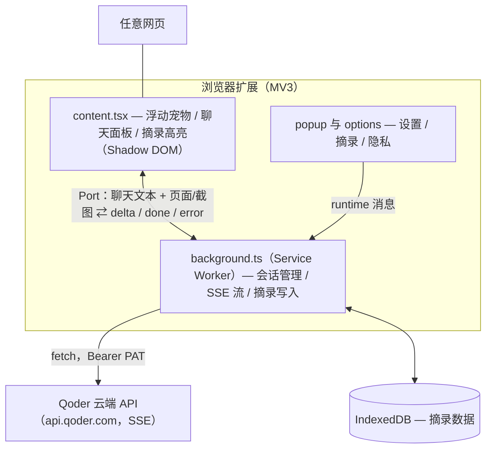

<p align="center">
  
</p>

<h1 align="center">Tab Agent</h1>

<p align="center">
  <a href="README.md">English</a> | <b>中文</b>
</p>

一只住在每个网页上的气泡小宠物。点击它提问，你配置的 Qoder 云端 Agent 会结合当前页面内容作答。

> [!NOTE]
> 本项目非 Qoder 官方产品，仅基于 Qoder Cloud Agents 构建；吉祥物形象借用了 Qoder 的 logo（因为可爱）。

## 功能

- **问页面** —— 点宠物提问，可携带当前页面（正文或截图）一起发问。
- **摘录** —— 右键菜单或快捷键 `Alt+Shift+S` 保存选中文字，text-fragment 高亮刷新不丢、可跨页跳转。

## 快速开始

前置条件：Node.js ≥ 22.13 与 pnpm；一个 [Qoder](https://qoder.com) 账号，且已开通 [Cloud Agents](https://docs.qoder.com/zh/cloud-agents/quickstart)。

```bash
pnpm install
pnpm build          # 产物在 .output/chrome-mv3/
```

Chrome 加载：

1. 打开 `chrome://extensions`，右上角开启「开发者模式」。
2. 点「加载已解压的扩展程序」，选择 `.output/chrome-mv3/` 目录。

Firefox：`pnpm build:firefox` / `pnpm dev:firefox`。

## 配置

扩展连接你自己的 Qoder 云端 Agent，需要三项凭证：

| 凭证 | 格式 | 从哪拿 |
|---|---|---|
| PAT | `pt-...` | [Qoder 控制台 → Settings → Personal Access Tokens → 新建](https://qoder.com/cloud/settings/tokens) |
| Agent ID | `agent_...` | [Cloud Agents 控制台](https://qoder.com/cloud/agents) → 你的 Agent |
| Environment ID | `env_...` | [同上，Agent 关联的环境](https://qoder.com/cloud/agents) |

填入方式：

1. 点浏览器工具栏的 Tab Agent 图标 → 齿轮图标（或右键图标 → 选项），打开设置页。
2. 依次粘贴 PAT / Agent ID / Environment ID。输入框失焦即保存。
3. 同页可切换语言与主题（跟随设备 / 深色 / 浅色）。

## 使用

1. 打开任意网页，右下角出现气泡宠物。
2. 点它提问——进入「思考」表情，回答流式出现。首次提问会自动创建云端会话，稍慢属正常。
3. 选中文字按 `Alt+Shift+S`（或右键）保存为摘录。可在 `chrome://extensions/shortcuts` 改键。

## 常见问题

| 现象 | 处理 |
|---|---|
| 提示「尚未配置」 | PAT / Agent ID / Environment ID 三项有缺，回设置页补全 |
| 提示「鉴权失败」 | PAT 失效或填错，重新生成一个 |
| 截图上下文不生效 | 在 Popup 选「截图」时会弹权限申请，需允许访问所有网站 |
| 想强制开新会话 | 在扩展的 Service Worker 控制台清掉 `local:sessionId.v4`（所有标签页当日共用一条），或重装扩展 |

## 开发

```bash
pnpm dev            # Chrome HMR 开发服务器（自动拉起浏览器）
pnpm test           # 运行测试（Vitest）
pnpm compile        # 仅类型检查
pnpm zip            # Chrome 商店提交包
pnpm zip:firefox    # Firefox AMO 提交包
```

添加 UI 组件：

```bash
pnpm dlx shadcn@latest add @retroui/<name>
```

## 项目结构



```
entrypoints/
  background.ts     # Service Worker 入口（菜单、快捷键、消息/Port 接线）
  content.tsx       # 内容脚本（浮动宠物 + 聊天面板 + 摘录高亮）
  popup/            # 工具栏弹窗
  options/          # Options 页（设置 / 摘录 / 隐私）
components/
  floating-agent.tsx  # 浮动宠物组合层（状态、port 流式、拖拽）
  agent/            # 展示组件：Mascot / ChatPanel / ClipDraftEditor
  category-chips.tsx  # 摘录分类筛选 chips（options 摘录页）
  radio-dropdown.tsx  # 图标+文本单选下拉（设置 / 弹窗 / 筛选共用）
  ui/               # RetroUI 组件（shadcn CLI）
lib/                # 共享模块（gateway、i18n、设置、SSE 解析器、摘录）
tests/              # Vitest 测试套件
```

## 技术栈

- **框架**：[WXT](https://wxt.dev)（基于 Vite 的扩展框架，Chrome MV3）
- **UI**：React 19 + [RetroUI](https://retroui.dev)（新粗野主义 shadcn 注册表）+ Tailwind CSS v4
- **图标**：[lucide-react](https://lucide.dev)
- **包管理**：pnpm

## 许可证

[MIT](LICENSE) © sheny。使用 [Qoder](https://qoder.com) 构建。
