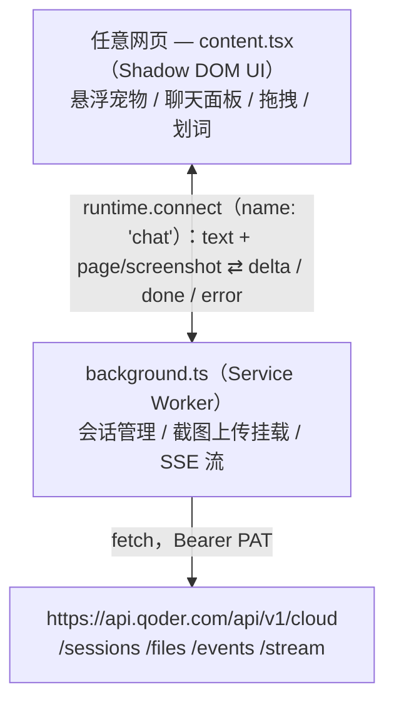
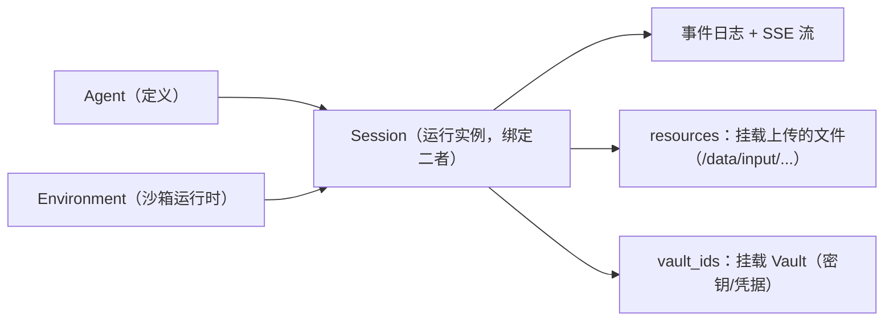
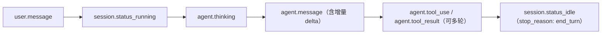

# Tab Agent 技术架构文档

## 1. 技术栈

| 层 | 选型 |
|---|---|
| 扩展框架 | [WXT](https://wxt.dev)（基于 Vite，MV3，按文件约定自动注册 entrypoint） |
| UI | React 19 + TypeScript + Tailwind CSS v4（`@tailwindcss/vite` 插件） |
| 组件库 | RetroUI（neobrutalist shadcn registry，组件以源码形式放在 `components/ui/`） |
| 图标 | lucide-react（具名导入，自动 tree-shake） |
| Markdown | 自写极简渲染器（`lib/markdown.tsx`，直接产出 React 元素，天然转义） |
| 正文提取 | @mozilla/readability（页面正文 → 纯文本） |
| 摘录高亮 | text-fragments-polyfill（fragment 生成/解析 + `<mark>` 包裹） |
| 包管理 | pnpm |

## 2. 模块结构

```
entrypoints/
  background.ts    # Service worker 入口注册：右键菜单 + 快捷键 + clips 消息/Port 编排（网络层在 lib/gateway.ts）
  content.tsx      # 内容脚本：悬浮宠物 + 聊天面板（Shadow DOM）+ 摘录高亮
  popup/           # 浏览器动作弹窗：宠物/摘录高亮开关 + 携带页面 + 打开设置
  options/         # 设置页（独立标签页）：Settings / Clips / Privacy 三页签（pages/，均 React.lazy 懒加载）
lib/
  gateway.ts       # Qoder 网关通信：api/createSession/uploadFile/SSE 流/handleChat 回合状态机（每日共享会话 + 跨天自总结）
  settings.ts      # 配置类持久化项（storage.defineItem）+ 主题工具
  sse.ts           # 纯函数 SSE 帧解析器（无 WXT 依赖）
  messages.ts      # runtime 消息协议：类型化 Request + sendRequest（content/options → background），Reply 信封仅模块内使用
  clips-store.ts   # 摘录存储：IndexedDB + 消息门面 + URL 归一（无 DOM 依赖，background/options 引它）
  clips-highlight.ts # 摘录高亮：text-fragment 生成/解析 + <mark> 包裹（text-fragments-polyfill，仅 content script）
  usage.ts         # 日期工具：本地时区 YYYY-MM-DD（会话按日轮换与日报归属日共用）
  page-text.ts     # 页面正文提取（Readability 封装 + 缓存，失败回退 innerText）
  marks.ts         # 摘录定位/高亮/淡出 + 划词草稿事件（content script 侧）
  markdown.tsx     # 自写极简 Markdown 渲染器（直接产出 React 元素，天然转义，无 innerHTML）
  i18n.ts          # 多语言（不用 browser.i18n：需设置页运行时切语言 + 菜单标题实时跟随，_locales 只跟随浏览器语言）
  i18n-content.ts  # content script 文案子集（避免 4 语言全量 dict 随 content bundle 进每个页面，tests/i18n.test.ts 断言与 i18n.ts 同步）
  utils.ts         # cn()（clsx + tailwind-merge）+ useStorageValue hook + onPageNav（SPA 导航）
assets/
  style.css        # 主题 token（CSS 变量 + @theme inline），popup/options 直接引入
  content.css      # 继承 style.css + Shadow UI 布局样式，仅进 Shadow Root
components/
  floating-agent.tsx  # 组合层：状态/effect/port 流式状态机 + 拖拽 + 外壳
  agent/           # 拆出的展示组件：Mascot / ChatPanel（纯展示）/ ClipDraftEditor
  ui/              # RetroUI 组件源码（shadcn CLI 添加）
tests/             # vitest 单元测试（pnpm test）+ tests/e2e/ 真浏览器 E2E（playwright-core，pnpm test:e2e / test:chat）
```

## 3. 运行时架构



关键决策：**所有网络请求收敛在 background**。内容脚本只通过长连接 Port 收发消息，凭证不进入页面上下文；Port 断开即中止后台请求（AbortController）。

另有一条轻量消息路径（`runtime.sendMessage`）：

- **摘录** —— background 的三个右键菜单（选区 / 整页 / 图片）或 `Alt+Shift+S` 快捷键：选区与整页走 content（`{type:'saveClip'}`/`{type:'saveClipPage'}`，content 有 Selection 与 DOM）生成后 `{type:'clipAdd'}` 回传；图片同样走 content（`{type:'saveClipImage'}`，页面侧读 `location.href`/`document.title` 零权限——background 读 `tab.url` 需要带安装警告的 `tabs` 权限），仅无 content script 的页面（chrome:// 等）由 background 降级直写。写入均落扩展 origin 的 IndexedDB（见 §6）。

## 4. 云端架构（Qoder Cloud Agents）

扩展没有自建后端，云端三个资源对象由 Qoder 托管（[文档](https://docs.qoder.com/zh/cloud-agents/quickstart)）：



| 对象 | 是什么 | 本扩展怎么用 |
|---|---|---|
| **Agent** | 静态定义：model、system prompt、启用的工具集（Bash/Read/Write/WebFetch…）、skills、MCP servers | 用户在 Qoder 控制台自建，扩展只持有 `agent_...` ID |
| **Environment** | 云端沙箱运行时：网络策略（unrestricted / allowed_hosts）、预装包（apt/npm/pip） | 用户自建，扩展只持有 `env_...` ID |
| **Session** | Agent × Environment 的运行实例，状态机 `idle ⇄ running`，持有完整事件日志 | 扩展创建并缓存 `sess_...`，聊天对话走它 |

### 事件模型

Session 是**事件日志 + 事件流**：写入靠 `POST /events`（`user.message`），读取靠 SSE `GET /events/stream`。一个回合内云端依序产生：



- 扩展用 `?event_deltas%5B%5D=agent.message` 订阅消息增量（**方括号必须 percent-encode**：字面 `[]` 会让流静默挂起整回合，2026-08-05 线上抓帧实锤）。增量帧（`event_start`/`event_delta`）之后有**同 id 的权威 buffered `agent.message`**，消费端按 `event_id` 去重；`user.message` 只有 buffered 事件，为回合边界（最后一条胜出）。[协议细节](https://docs.qoder.com/zh/cloud-agents/events-stream)
- `heartbeat` 约每 15s 一次保活，`parseSSE` 按无 data 帧丢弃。
- 流重连时支持 `Last-Event-ID`。扩展把最近完成回合的事件游标按会话持久化，下一轮从游标之后开始读取；首次安装、游标丢失或会话切换时仍依赖 background 里的 `isPosted()` 闸门丢弃 POST 之前的事件。
- Agent 在环境沙箱内执行工具；上传文件挂载到 `/data/input/` 后，Agent 用自己的 Read/Bash 工具读取。

### 本项目实例配置

云端三个对象均命名为 `tab-agent`（ID 不入库，填在扩展设置页）：

**Agent**

- 模型：Qwen3.7-Plus，上下文 400K
- 系统提示词：

  ```
  角色
  你是 Tab Agent 的云端助手：一个面向浏览器用户的通用 AI 助手，帮用户研究、写代码、处理文档、整理知识。你的回答服务对象是浏览器的普通用户，语言跟随用户的提问语言（界面语言可能是 en/zh-CN/zh-TW/ja），简短对话给简洁答案，复杂任务给结构化说明。

  视野与能力边界
  用户当前页面的内容以 user message 中 [Page context] 块（URL/标题/正文）为准，它来自用户本地浏览器，你的云端环境看不到该页面。
  禁止用 WebFetch 重新抓取 [Page context] 给出的 URL；内容已在消息内联。
  截图（如有）挂载在 /data/input/screenshot.jpg，包含文本提取不到的可视信息，优先查看。
  上传的其他文件在 /data/input/ 下，用 Read/Bash 读取。
  你的环境是隔离沙箱，除挂载资源外看不到用户本地任何文件。

  工具使用准则
  搜索用 WebSearch；抓取指定外部链接用 WebFetch。
  文档处理：环境预装 python-docx/pymupdf/openpyxl/python-pptx，用 Bash + Python 处理，产物文件最终用 DeliverArtifacts 交付。
  凭证：notion 凭证已通过 Vault 提供，直接调用，不要向用户索要 token。
  写操作（notion 写入等外部副作用）只在用户明确请求时执行，不主动发起。

  行为准则
  只依据消息内联内容与工具返回事实作答；不确定时明说，不臆造页面内容或文件路径。
  长任务边做边输出进展（思考、中间结论），不要憋到最后一次性汇报。
  会话是连续的：后续提问可引用前文结论。

  复杂任务
  研究类任务按深入研究 skill 的流程执行。
  ```
- 工具：6 个内置工具全部自动允许 —— Bash / Read / Write / WebFetch / WebSearch / DeliverArtifacts
- MCP 服务器（均 streamable http、自动允许）：
  - notion（`mcp.notion.com/mcp`）
- Skills（custom）：深入研究

**Environment**（Cloud）

- 预装 pip 包：python-docx、pymupdf、openpyxl、python-pptx（均 latest）—— 服务于文档处理类任务

**Vault**

- 存放 notion MCP 服务器的 OAuth 凭证 —— 创建会话时附带 `vault_ids` 挂载，MCP 鉴权通过

## 5. 一次对话回合（tryTurn）

`lib/gateway.ts` 的 `handleChat` 中一个回合的顺序，设计目标是「不丢事件、可自愈」。会话为**每日共享**：所有 tab 同一天共用同一云端会话（缓存键 `sessionId.v4`，值 `{id, day}`），归属以**最后一条回复的完成日**为准——跨午夜回合（23:56 发、00:12 答完）仍属旧会话，done 时把 day 刷成完成日；下一条消息发现 day 不符才重建当日新会话（session 标题带日期）。已知代价：共享会话下 tab B 的 409-cancel 会截断 tab A 进行中的回合（单用户轻聊可接受）。

**跨天日报**：重建前若旧会话存在且当日未总结过（`reportSent` 标记去重），先对旧会话 fire-and-forget 发一条总结指令——旧会话上下文即当日完整对话记录，云端 Agent 自行用 notion MCP 写入 Notion 日报；失败仅留痕不阻断新会话。浏览器关闭期间不触发，顺延到下次打开并发消息时。

1. 携带页面为「截图」时，background 用 `tabs.captureVisibleTab` 截**sender 窗口**的可见区域（仅扩展上下文可调，需 `<all_urls>` 可选权限；省略 windowId 会截到聚焦窗口，可能不是发起聊天的那个），`POST /files` 上传一次，再 `POST /sessions/{id}/resources` 挂载到 `/data/input/screenshot.jpg`。
2. **先开 SSE 流**（`GET /sessions/{id}/events/stream?event_deltas%5B%5D=agent.message`），后发消息 —— 保证不错过任何 delta。
3. `POST /sessions/{id}/events` 发送用户消息；页面上下文（Readability 提取纯文本，失败回退 innerText，截断 20k）与截图说明**内联进消息正文**（带浏览器工具的 Agent 会忽略侧信道上下文，自己打开空白的云端浏览器）。
4. 流内以最后一条 buffered `user.message` 为回合边界（**不设 posted 条件**：事件广播与 POST 响应并发到达，带条件的边界帧若被丢弃不会重放，整回合静默）；`isPosted()` 闸门过滤 POST 返回前重放的旧回合 delta / idle 事件。
5. `session.status_idle` → 发 `done`，回合结束。

### 异常自愈

| 状态 | 处理 |
|---|---|
| 401/403（`api()` 统一出口） | 抛 `code:'auth'`，前端展示鉴权失败文案 |
| 404（会话失效） | `tryTurn` 返回 false → 重建 session（带 vault_ids）→ 整回合重试一次 |
| 409（上一回合仍在跑） | `POST /cancel` 后等 `session.status_idle`（5s 安全网），重发，最多 2 次 |
| SSE 静默 90s（代理断流 / worker 挂起，心跳约 15s 一次） | 读超时 reject，回合按错误收尾 |
| 流提前关闭（未收到 idle） | 补发 `done` 收尾，前端不卡「思考中」 |
| MV3 worker 30s 无 API 活动被回收 | 回合期间每 20s `runtime.getPlatformInfo()` 保活；仍被杀则前端 `port.onDisconnect` 渲染「连接中断」 |
| 用户重新提交 | 前端 disconnect Port → 后台 abort → 新回合 |

### 错误码

消息层（`lib/messages.ts`）的 `Reply<T>` 信封与聊天层（`lib/gateway.ts`）的 `ChatOut` 共用一套错误码，调用方可按码区分处理：

| 错误码 | 来源 | 含义 | UI 表现 |
|---|---|---|---|
| `unconfigured` | `handleChat` | PAT/Agent ID/Env ID 未配置 | 聊天气泡提示「请到设置页填写」 |
| `auth` | `api()` 统一出口 | 401/403，PAT 无效或过期 | 聊天气泡提示「检查 PAT」 |
| `invalid` | background `onMessage` | 消息载荷校验失败（客户端 bug） | 无 UI（调用方不应发送非法载荷） |
| 无码（undefined） | 网络/超时/IDB 等运行时错误 | 通用失败 | 聊天气泡提示「请求失败，请重试」 |

## 6. 状态与存储

**配置项**集中在 `lib/settings.ts`，使用 WXT 的 `storage.defineItem`（`local:` 前缀），各页面通过 `.watch()` 实时同步：

| Key | 用途 |
|---|---|
| `theme` / `petEnabled` / `petPos` | 外观、宠物开关、宠物位置 |
| `pageCarry` | 携带页面：none / article / screenshot |
| `clipHighlight` / `highlightColor` | 摘录高亮开关 / 高亮颜色（yellow / purple / green / blue） |
| `lang`（定义在 `lib/i18n.ts`） | 界面语言 en / zh-CN / zh-TW / ja |
| `pat` / `agentId` / `envId` / `vaultId` | Qoder 凭证 |
| `reportSent` | 日报去重标记：已发起总结的会话归属日（YYYY-MM-DD） |
| `sessionId.v4` | **每日共享**会话缓存，值 `{id, day}`：所有 tab 同一天共用；归属以最后回复完成日为准，跨天重建并触发旧会话自总结（v3→v4 为按日轮换，值由 id 字符串改为对象） |
| `eventCursor.v1` | SSE 事件游标，值 `{sessionId, eventId}`：下一轮请求通过 `Last-Event-ID` 跳过已消费的历史事件 |

**摘录数据**（`lib/clips-store.ts`）存**扩展 origin** 的 IndexedDB（库 `tab-agent`，store `clips`，keyPath `id`；v2 另建 `createdAt`/`pageUrl` 索引，分别支撑 newest-first 读取与按页读取），storage 不存内容。记录结构：`{id, url, pageUrl, title, text, createdAt}` + `kind?`（`'page'`/`'image'`，缺省 = 选区摘录）+ `imageSrc?` + `category`/`tags` + 用户备注 `notes`。关键约束：content script 运行在**页面 origin**，其 IndexedDB 按站点隔离，跨站摘录会互不可见——因此 DB 只在扩展 origin 打开，content script 经消息代理读写：

- **读写分离**：background 是唯一写者。所有写操作（`addClip`/`removeClip`/`updateClip`，不分 origin）都走 `runtime.sendMessage`（`clipAdd`/`clipDel`/`clipUpdate`）由 background 经 `*Direct` 系列写库；读操作分 origin——扩展 origin（options）经 `getClipsDirect` 直接读，content script 的按页 item 走 `clipsGetForPage` 消息（`pageUrl` 索引，O(本页) 而非全表扫描）。background `onMessage` 用 `return true` 保持异步通道，并统一回 `{ok:true,data}` / `{ok:false,error}` 信封，避免 direct 操作 reject 时发送方永久挂起。`updateClipDirect` 对来自页面消息的 patch 做白名单 + 类型校验（id 是 keyPath，不校验可整体覆盖另一条记录）。
- **变更同步**：写库后 background 双通道广播 `{type:'clipsChanged'}`——`tabs.sendMessage` 到所有 tab 的 content script（watcher 收到后只重拉本页摘录，幂等），`runtime.sendMessage` 到 options 等扩展页（`tabs.sendMessage` 到不了扩展页）。按页 item 保持与 WXT storage item 同形的 `getValue`/`watch`，消费方经 `useStorageValue` 无感切换。
- **排序稳定**：`addClipDirect` 用 `Math.max(Date.now(), last+1)` 保证 `createdAt` 单调，同毫秒连续摘录的 newest-first 顺序确定。
- **URL 归一**：`normalizeUrl` 去 hash 并删跟踪参数（`utm_*`/`fbclid`/`gclid` 等常见清单），同文多链归一到一个 key；「本页摘录」匹配与 `pageUrl` 入库都走它。
- **跨页跳转 URL**：`clipNavUrl` 带 `#tab-agent-clip=<id>` 而非 text-fragment——原生 `::target-text` 高亮无法编程清除，「关闭高亮时淡出」会失效；目标页 content script 按 id 查库后走 `showClip` 同一条定位/高亮/淡出路径，消费后 `history.replaceState` 清掉 hash。
- **失配兜底**：fragment 失配（页面改动/动态渲染）时按 `clip.text` 在文本节点中直接查找重锚（跳过 script/style 等子树，避免向脚本字符串插 `<mark>`）；裸 URL 摘录保持不高亮；图片摘录按 `src`/`currentSrc` 精确匹配原图，以轮廓高亮。

## 7. 内容脚本 UI 隔离

- `createShadowRootUi` + `cssInjectionMode: 'ui'`：Tailwind 样式（`assets/content.css`，继承 `assets/style.css` 的主题 token）只进 Shadow Root。
- 主题：`isDark(theme)` 在 shell 上切 `dark` class，与宿主页面无关。
- 雪碧图 `mascot-expressions.webp` 经 `web_accessible_resources` 暴露，三个表情帧靠 transform 裁切。
- 宠物关闭 = 完全不挂载 React（省每页运行时与堆）；挂载/卸载串行在一条 promise 链上，快速开关不竞态。代价是关闭即中断进行中的回答、重开后聊天记录重置——与「关闭宠物」的用户意图一致。
- 摘录高亮重放走 `requestIdleCallback` 逐条切片（大页不阻塞首帧）；开关切换用 generation 计数作废在途回调，避免关闭后残留回调重新加 `<mark>`。
- SPA 同文档导航（pushState/replaceState/popstate）：`onPageNav`（lib/utils.ts，Chrome navigation API，Firefox 降级 popstate/hashchange——isolated world patch 不到页面世界的 pushState）触发重锚：清旧页 mark、作废在途回调、按新 URL 重放；面板 ClipList 同样按 URL 变化重订阅。
- 所有监听（message/highlight watch/nav/pet watch）经 `ctx.onInvalidated` 统一注销——生产与页面同生命周期无泄漏，dev HMR 下防止脚本失效重跑叠加监听。

## 8. 权限与安全

- manifest 权限：`storage` + `contextMenus`（右键保存摘录：选区/整页/图片三个菜单）+ host `https://api.qoder.com/*`；截图所需 `<all_urls>` 为 `optional_host_permissions`，用户在 popup 选「截图」的点击手势内才申请。`minimum_chrome_version: '116'`（`AbortSignal.any` 需要）；不用 `tabs` 权限（带「浏览历史」安装警告）——图片剪藏改走 content script 读 `location.href`/`document.title`。
- 消息面防御：`clipUpdate` patch 白名单 + 类型校验（`sanitizePatch`），`clipAdd` 载荷宽松校验（`text` 必填、其余字段存在即查型），Port 消息要求 `text` 为字符串——页面消息不可信，脏类型入库会击穿下游渲染。
- `commands` 声明 `save_clip`（默认 `Alt+Shift+S`，可在 `chrome://extensions/shortcuts` 改键）：复用右键菜单同一条 content script 保存路径，无需额外权限。
- 凭证输入框为 password 型（浏览器原生禁止复制）；PAT 只在 background 的请求头中出现，不进日志与错误文案。

## 9. 构建与校验

```bash
pnpm dev / dev:firefox      # HMR 开发
pnpm build / build:firefox  # 产物 → .output/{chrome,firefox}-mv3/
pnpm compile                # tsc --noEmit 类型检查
pnpm test                   # vitest 单元测试
pnpm test:e2e / test:chat   # 真浏览器 E2E（playwright-core，需先 pnpm build）
pnpm zip                    # 打包提交商店
```

业务代码改动后以 `pnpm build` + `pnpm test` 通过为准。
